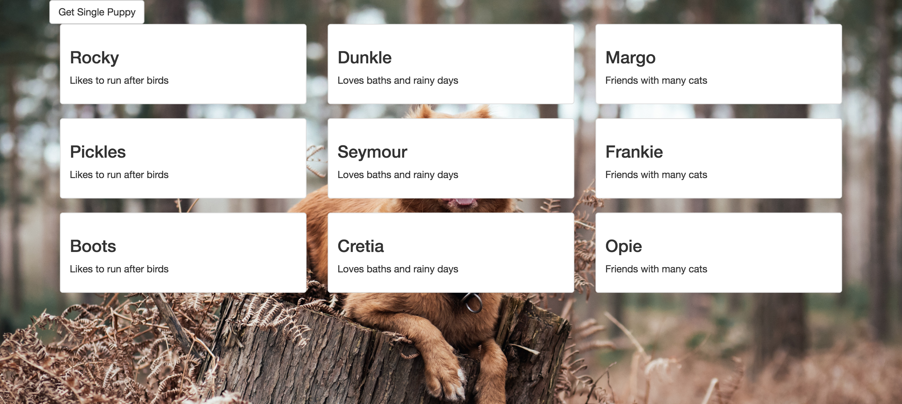

# pup-promises

We have lots of data sets that have puppy and food information, and we want to print that out to the page! To do this, we are going to use JQuery AJAX and Promises in a couple of different ways.

How to run:
1. If you haven't installed http-server, run `npm install http-server -g`
1. If you haven't installed grunt-browserify locally, run `npm install grunt-browserify -g`
1. Clone the repo down
1. run `cd pup-promises/lib`
1. run `npm install` to install dev dependencies
1. run `grunt` to compile the javascript files
1. run `cd ..` & `http-server` to run the application locally